<p align="center">
  
</p>

<h1 align="center">👁️ Prompt Engineering for Vision Models</h1>

<p align="center">
  <em>Hands-on tutorials from the <a href="https://www.deeplearning.ai/short-courses/prompt-engineering-for-vision-models/">Prompt Engineering for Vision Models</a> course</em>
</p>

<p align="center">
  
  
  
  
  
</p>

---

## 📖 About

This repository contains **Jupyter Notebook tutorials** based on the **[Prompt Engineering for Vision Models](https://www.deeplearning.ai/short-courses/prompt-engineering-for-vision-models/)** short course from **DeepLearning.AI**, created in partnership with **Comet**.

The course teaches how to prompt and fine-tune cutting-edge vision models — from image segmentation and object detection to image generation and diffusion model fine-tuning. You'll work hands-on with models like **Meta's SAM**, **OWL-ViT**, and **Stable Diffusion 2.0**, learning to control them through text prompts, coordinates, bounding boxes, and hyperparameter tuning.

> **⚠️ Disclaimer:** All course content, concepts, and educational material are the intellectual property of **[DeepLearning.AI](https://www.deeplearning.ai/)** and **[Comet](https://www.comet.com/)**. This repository is for personal learning purposes only. Full credit goes to the original creators.

---

## 🎓 Credits & Acknowledgements

| | |
|---|---|
| 🏫 **Course Provider** | [DeepLearning.AI](https://www.deeplearning.ai/) |
| 👩‍🏫 **Instructors** | [Abby Morgan](https://www.linkedin.com/in/abby-morgan/), [Jacques Verré](https://www.linkedin.com/in/jacquesverre/), & [Caleb Kaiser](https://www.linkedin.com/in/caleb-kaiser/) |
| 🔭 **AI Partner** | [Comet ML](https://www.comet.com/) |
| 🔗 **Course Link** | [Prompt Engineering for Vision Models](https://www.deeplearning.ai/short-courses/prompt-engineering-for-vision-models/) |

---

## 📚 Tutorial Overview

| # | Tutorial | Original Name | Description | Key Concepts |
|:-:|----------|---------------|-------------|:------------:|
| 1 | [**Image Segmentation**](01_Image_Segmentation.ipynb) | `L2-Image-Segmentation` | Prompt Meta's Segment Anything Model (SAM) using positive/negative coordinates and bounding boxes to identify and outline objects within images | `SAM` `Coordinates` `Bounding Boxes` `Masks` |
| 2 | [**Object Detection**](02_Object_Detection.ipynb) | `L3-Object-Detection` | Use natural language text prompts to produce bounding boxes that isolate specific objects within images using Google's OWL-ViT model | `OWL-ViT` `Text Prompts` `Bounding Boxes` `Zero-Shot Detection` |
| 3 | [**Image Generation**](03_Image_Generation.ipynb) | `L4-Image-Generation` | Generate images from text prompts using Stable Diffusion 2.0 and learn to tune hyperparameters like guidance scale, strength, and inference steps | `Stable Diffusion` `Guidance Scale` `Inference Steps` `Text-to-Image` |
| 4 | [**Fine-Tuning**](04_Fine_Tuning.ipynb) | `L5-Fine-Tuning` | Fine-tune diffusion models using DreamBooth for personalized, controlled image generation and track experiments with Comet | `DreamBooth` `Fine-Tuning` `Diffusion Models` `Experiment Tracking` |

---

## 🛠️ Getting Started

### Prerequisites

- Python 3.8+
- GPU recommended (for Stable Diffusion / SAM inference)

### Installation

```bash
# Clone this repository
git clone https://github.com/your-username/Prompt_Engineering_4_Vision_Models.git
cd Prompt_Engineering_4_Vision_Models

# Install dependencies
pip install torch torchvision transformers diffusers segment-anything comet-ml jupyter

# Launch Jupyter Notebook
jupyter notebook
```

---

## 🗂️ Repository Structure

```
Prompt_Engineering_4_Vision_Models/
├── 📄 README.md
├── 🖼️ assets/
│   └── banner.png
├── 📓 01_Image_Segmentation.ipynb
├── 📓 02_Object_Detection.ipynb
├── 📓 03_Image_Generation.ipynb
└── 📓 04_Fine_Tuning.ipynb
```

---

## 🧩 What You'll Learn

```mermaid
graph LR
    A["🔍 Image Segmentation"] --> B["📦 Object Detection"]
    B --> C["🎨 Image Generation"]
    C --> D["⚙️ Fine-Tuning"]

    style A fill:#FF6B6B,stroke:#333,color:#fff
    style B fill:#FFA07A,stroke:#333,color:#fff
    style C fill:#FFD700,stroke:#333,color:#333
    style D fill:#9370DB,stroke:#333,color:#fff
```



| Module | Models & Tools | What You'll Build |
|--------|---------------|-------------------|
| **Image Segmentation** | SAM (Segment Anything) | Segment objects with point prompts & bounding boxes |
| **Object Detection** | OWL-ViT | Detect objects using natural language queries |
| **Image Generation** | Stable Diffusion 2.0 | Generate images with tunable hyperparameters |
| **Fine-Tuning** | DreamBooth + Comet | Personalize diffusion models for custom subjects |

---

## 📜 License

This repository is for **educational purposes only**. All course materials, concepts, and content belong to [DeepLearning.AI](https://www.deeplearning.ai/) and [Comet](https://www.comet.com/).

---

<p align="center">
  <strong>⭐ If you find this helpful, please give it a star! ⭐</strong>
</p>

<p align="center">
  Made with ❤️ for the AI & Computer Vision community
</p>
